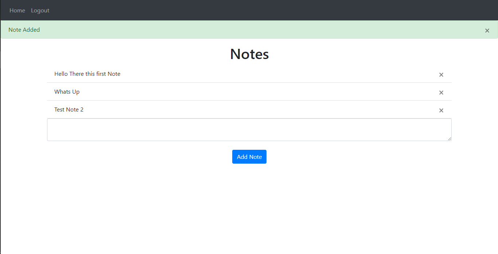
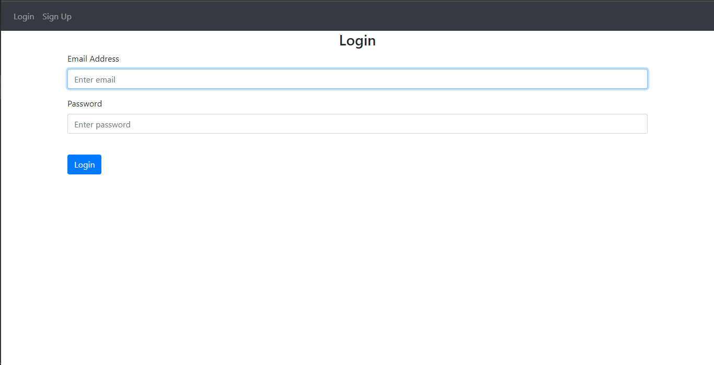
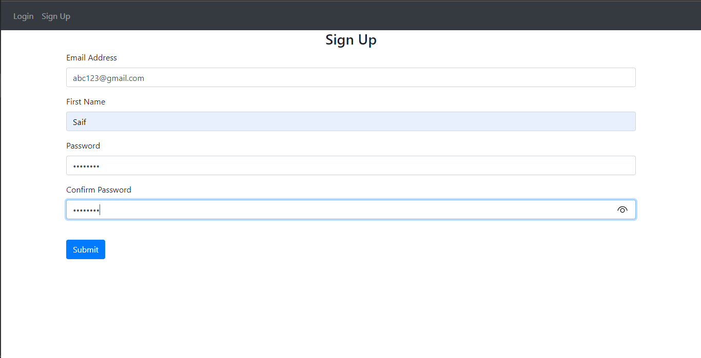
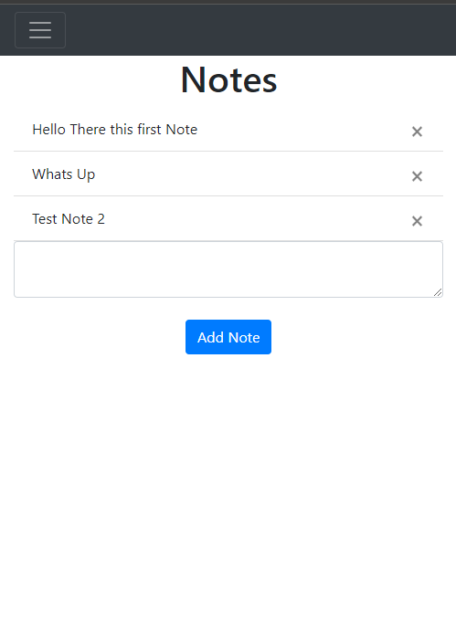

# Flask-Notes-Login-WebApp
A Python WebApp that uses Flask framework for Login and Web Backend and SQL Database for Storing of user details and notes of each users separately

<table>
  <tr>
    <th>HOME/NOTES Page </th>
    <th>LOGIN Page </th>
  </tr>
  <tr>
    <td></td> 
    <td></td>
  </tr>
  <tr>
    <th>SIGN UP Page</th>
    <th>Mobile View Home Page</th>
  </tr>
    <tr>
    <td></td> 
    <td></td>
  </tr>
</table>


## Getting Started

These instructions will get you a copy of the project up and running on your local machine for development and testing purposes.

### Prerequisites

Things you need to run the code

```
Python 3
```
### Installing

Follow These Instruction.

Install following packages
```python 
pip install flask
pip install Flask-SQLAlchemy
pip install flask-login
```

  <b>OR</b>

```python 
 pip install -r requirements.txt
```

### Running The App
```python 
python main.py
```
  And then Go to [http://127.0.0.1:5000](http://127.0.0.1:5000) [Local Server] to view and use the WebApp


## Built With

* [Python 3](https://www.python.org/) - The Programming Language used.
* [Flask](https://flask.palletsprojects.com/en/1.1.x/) - Flask is a micro web framework written in Python.
* [SQL Alchemy](https://www.sqlalchemy.org/) - SQLAlchemy is an open-source SQL toolkit and object-relational mapper for the Python.

## 📃 License

This project is licensed under the MIT License - see the [LICENSE](LICENSE) file for details

***
> Feel free to star ⭐ this repository if you like what you see 😉.

